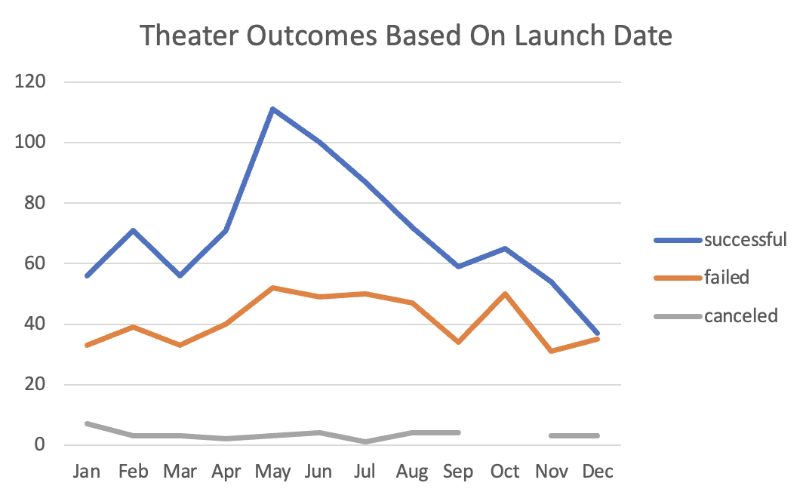
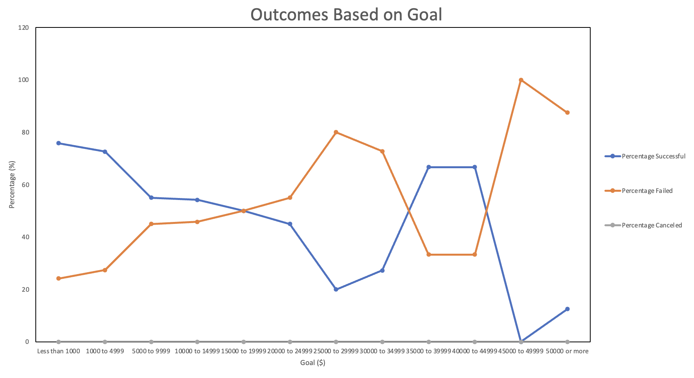

# Kickstarting with Excel

## Overview of Project

Analysis to help upcoming playright, Louise, get funding for her play "Fever." She's estimating a budget of over $10,000 and is understandably hesitant about jumping into her first fundraising campaign. The goal is to use Excel to organize, sort, and analyze crowdfunding data to determine whether there are specific factors that make a project's campaign successful.

### Purpose

Use the insights to analyze current site data which can help Louise better understand campaigns from start to finish, in order to set up her campaign to mirror other successful ones in the same category. 

## Analysis

Using the keyboard shortcut command + down arrow, we were quickly able to see this was a large data set with over 4k rows. Givent this stat, we decided to use pivot tables to more thoroughly correlate this data. Additionally visulzatons, specifically line graphs, allowed us to determine trends across time.

### Outcomes Based on Launch Date

### Outcomes Based on Goals

### Challenges Encountered

Some challenges in working with the data was that it needed to be organized and sorted before taking on any type of anlaysis. This was done by:

* Separating the parent categories and subcategories into seperate columns.
* Converting the "Deadline" and "Launched_at" column formats from a Unixm timestamp into a day-month-year format that we can interpret within a new column called "Date Created Conversion." This represents actual time of the campaign launch.
* The overall date range across the entire data set is to sparse and needed to be reduced to a more manageable subset for better analysis - this was be done by adding a new column called "year" to extract the year from the date converted column. This allowed to us to gather more data for each month in the year, across all parent and subcategory columns for the pivot tables.

## Results

What are two conclusions you can draw about the Outcomes based on Launch Date?

- Across each month of the year, there is a much higher number of successful plays vs failed or cancelled, with highest number of plays in May.

What can you conclude about the Outcomes based on Goals?

- The majority of campaings with funding goals over $45k perform worse (failed) than successful ones.
- Over 50% of campaigns with funding goals at $10k or below were successful.
- Over 50% of campaigns with funding goals between $35-$40k were successful.

What are some limitations of this dataset?
- The amont of data per category and subcategory may vary potentially causing it to skew more or less successfull in terms of outcome percents.

What are some other possible tables and/or graphs that we could create?
- Line graphs outlining categories with a successful outcome, by months and number of plays to see which was the best and when.
- Line graph outlining categories with a failed outcome, by months and number of plays to see which was the best and when.
- Line graph of the theater category's subcategories successful outcome to see which were most successfull and when.
- Line graph of the theater category's subcategories failed outcome to see which were most successfull and when. 
- Line graph of the theater category's subcategories  who successful and their goal range to see which were most successfull and when.
- Line graph of the theater category's subcategories failed outcome and their goal range to see which were most successfull and when. 
